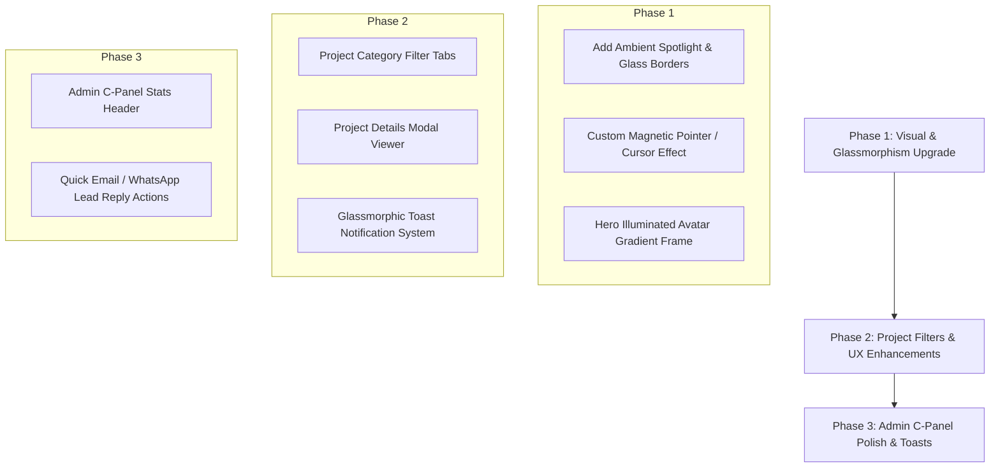

# Portfolio Website Review & Implementation Plan

## 📊 Executive Summary & Verdict

**Overall Rating:** `8.5 / 10` — **Solid & Functional Baseline**

Your portfolio website is **very well-structured, modern, and functionally robust**. Features like a live Node.js + Express backend, SQLite database, dynamic API, theme switcher, and built-in Admin C-Panel put it well ahead of typical static portfolios.

| Criteria | Score | Comments |
| :--- | :---: | :--- |
| **Backend & Architecture** | 9.5/10 | Excellent Express + SQLite setup with clean REST API endpoints for content and leads. |
| **Design & Typography** | 8.0/10 | Modern typography (Sora, Inter, JetBrains Mono) with dark mode palette. |
| **Interactivity & FX** | 7.5/10 | Good micro-animations (starfield, typing cursor, float badges), but can be elevated with 3D tilt and ambient card glows. |
| **Mobile Responsiveness** | 8.5/10 | Responsive navigation drawer and stacked hero sections. |
| **Admin C-Panel UX** | 8.0/10 | Full CRUD for portfolio data and leads inbox embedded directly in `index.html`. |

---

## 🎨 Recommended Customizations & Theme Upgrades

### 1. Visual & Aesthetic Upgrades ("WOW" Factor)
* **Glassmorphic Ambient Glow Cards**: Enhance project and skill cards with glowing gradient borders (`border: 1px solid rgba(124, 92, 255, 0.25)`), backdrop blur (`backdrop-filter: blur(16px)`), and cursor-following spotlight effects on hover.
* **Custom Interactive Magnetic Cursor**: Add a sleek glowing cursor dot that follows mouse movements and expands over interactive elements.
* **Refined Hero Avatar Frame**: Upgrade the portrait container with an illuminated gradient ring, status indicators, and subtle floating tech icons.
* **Particle / Ambient Blob Animation**: Elevate the background visuals with smooth reactive ambient glowing blobs.

### 2. Feature & Component Upgrades
* **Project Category Filter Tabs**: Add interactive filter buttons (`All`, `Mobile (Flutter)`, `Web Apps`, `E-Commerce`) to organize projects cleanly.
* **Project Lightbox / Details Modal**: Allow users to click project cards for extended descriptions, tech stack tags, live preview links, and GitHub source links.
* **Toast Notification System**: Replace browser `alert()` popups with glassmorphic toast notifications when sending contact messages or saving admin settings.
* **Interactive Skill Badges**: Group skills into visual tabs (e.g. Flutter/Mobile, Web & Frontend, Backend & Database) with animated progress bars or rings.

### 3. Admin C-Panel Enhancements
* **Dashboard Overview Stats**: Display quick metric cards (Total Leads, Active Projects, Tech Stack items).
* **Direct Lead Contact Actions**: One-click "Reply via Email" (`mailto:`) or "Contact on WhatsApp" (`wa.me`) directly inside the Admin leads list.

---

## 🛠️ Step-by-Step Implementation Plan

### Phase 1: Visual & Glassmorphism Upgrade
1. **Glassmorphism Tokens**:
   - Add backdrop blur, subtle borders, and hover glow effects to project cards and nav in `styles.css`.
   - Implement card mouse-move spotlight effect.
2. **Hero Avatar Frame**:
   - Add glowing gradient border and status badge around portrait.

### Phase 2: Interactive Components & UX
1. **Project Category Filtering**:
   - Update `index.html` React state with `category` filter pills.
2. **Project Modal Viewer**:
   - Implement interactive project details modal with live demo / GitHub links.
3. **Toast Notifications**:
   - Replace standard alert calls with clean floating glass toast notifications.

### Phase 3: Admin C-Panel Polish
1. **Admin Lead Reply Shortcuts**:
   - Add direct email and WhatsApp shortcuts in the Admin leads table.
2. **Admin Overview Counter**:
   - Show summary metrics (Leads received, Active Projects, Skills count) at the top of Admin C-Panel.

---

## 🎯 Next Steps

Would you like me to start implementing **Phase 1 (Glassmorphism & Visual Upgrades)** and **Phase 2 (Project Filters, Modal Viewer, and Toast Notifications)** right away?
